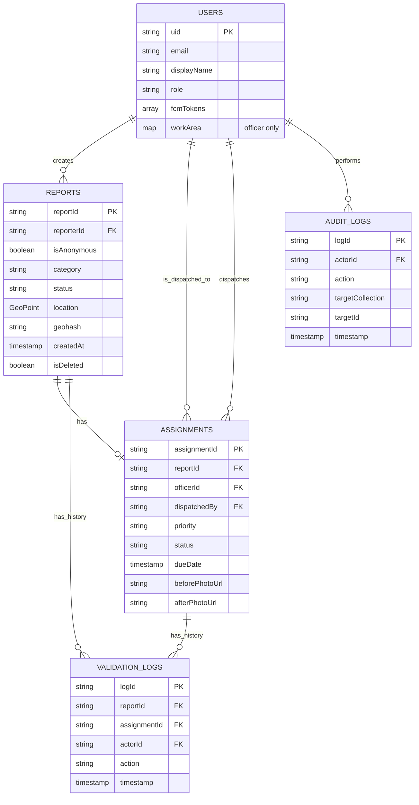
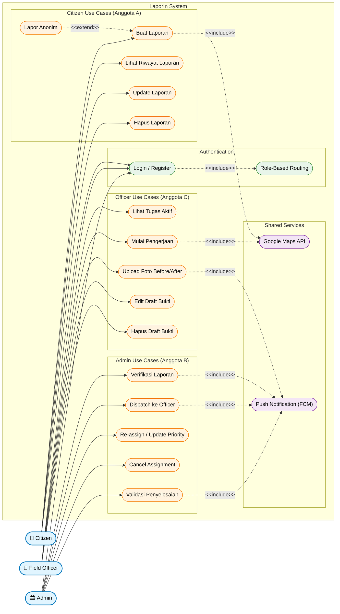

# Dokumen Perencanaan Final Project — LaporIn

> **Platform Smart City untuk Pelaporan Infrastruktur Publik**
> Mobile Application — Flutter + Firebase
> Tim: 3 Anggota

---

## Daftar Isi

1. [Project Overview](#1-project-overview)
2. [User Persona](#2-user-persona)
3. [Functional & Non-Functional Requirements](#3-functional--non-functional-requirements)
4. [Pembagian Fitur per Anggota](#4-pembagian-fitur-per-anggota)
5. [App Flow / User Flow](#5-app-flow--user-flow)
6. [Daftar Screen (Inventarisasi UI)](#6-daftar-screen-inventarisasi-ui)
7. [Arsitektur Sistem](#7-arsitektur-sistem)
8. [Struktur Database (Firestore Schema)](#8-struktur-database-firestore-schema)
9. [Use Case Diagram (Mermaid)](#9-use-case-diagram-mermaid)
10. [Catatan Risiko & Mitigasi](#10-catatan-risiko--mitigasi)

---

## 1. Project Overview

### 1.1 Judul Proyek

**LaporIn** — Aplikasi mobile pelaporan kerusakan infrastruktur publik dengan alur kerja terintegrasi antara warga, petugas lapangan, dan supervisor dinas.

### 1.2 Tema & SDG Alignment

Proyek ini selaras dengan **United Nations Sustainable Development Goals (SDGs)**, dengan fokus pada:

| SDG | Nama | Target Spesifik | Kontribusi LaporIn |
|---|---|---|---|
| **SDG 11** | Sustainable Cities & Communities | 11.3 (urbanisasi inklusif), 11.7 (akses ruang publik yang aman) | Memungkinkan warga partisipatif dalam pemeliharaan infrastruktur kota |
| **SDG 16** | Peace, Justice & Strong Institutions | 16.6 (institusi akuntabel), 16.7 (pengambilan keputusan partisipatif) | Audit trail digital dan transparansi status laporan menciptakan akuntabilitas pemda |
| **SDG 9** | Industry, Innovation & Infrastructure | 9.1 (infrastruktur berkualitas dan tangguh) | Digitalisasi alur kerja pemeliharaan infrastruktur publik |

### 1.3 Problem Statement

Di banyak daerah di Indonesia, warga menghadapi tiga masalah utama terkait kerusakan infrastruktur publik:

1. **Tidak ada channel pelaporan yang jelas.** Warga sering tahu ada jalan berlubang, drainase tersumbat, atau lampu jalan mati, tetapi tidak tahu harus melapor ke instansi mana, melalui kanal apa, dan tidak yakin laporannya akan ditanggapi.

2. **Pemerintah daerah tidak memiliki data terpusat.** Laporan masuk dari berbagai kanal yang terfragmentasi (WhatsApp RT, media sosial, surat fisik) sehingga Dinas PUPR sulit melakukan prioritisasi, distribusi tugas, dan pelaporan kinerja yang akurat.

3. **Tidak ada akuntabilitas penyelesaian.** Setelah laporan disampaikan, warga tidak tahu apakah perbaikan dilakukan, kapan selesai, dan dengan kualitas seperti apa. Ini menyebabkan apatisme dan turunnya partisipasi publik.

### 1.4 Solusi yang Ditawarkan

LaporIn adalah aplikasi mobile cross-platform (Flutter) yang menyatukan tiga aktor dalam satu sistem terintegrasi:

- **Warga (Citizen)** dapat melaporkan kerusakan dalam <30 detik dengan foto, lokasi otomatis, dan opsi anonim.
- **Petugas Lapangan (Field Officer)** menerima tugas yang sudah terverifikasi, melakukan perbaikan, dan mengunggah bukti Before-After.
- **Admin/Supervisor Dinas** mengelola triage laporan, dispatch tugas, dan memvalidasi penyelesaian melalui dashboard.

### 1.5 Pitch Singkat

> *"Jalan berlubang yang dilaporkan pagi, tertugaskan siang, diperbaiki sore — dan warga punya bukti foto Before-After di HP-nya sebelum makan malam. Itulah yang LaporIn coba wujudkan: siklus pelaporan yang transparan, cepat, dan menjawab apatisme warga terhadap layanan publik."*

---

## 2. User Persona

> *Catatan: Karena sistem ini melibatkan tiga aktor dengan goals yang sangat berbeda, kami menyajikan tiga persona ringkas — bukan untuk memperumit dokumen, tetapi karena pemilihan fitur untuk masing-masing aktor harus berbasis pemahaman kebutuhan mereka yang spesifik.*

### Persona 1 — Warga (Citizen)

| Atribut | Detail |
|---|---|
| **Nama** | Rian Pratama |
| **Demografi** | 28 tahun, karyawan swasta di Sidoarjo, komuter motor harian |
| **Device** | Android mid-range (Samsung A24), kuota 15GB/bulan |
| **Goals** | (1) Jalan rute kerjanya tidak berbahaya, (2) tahu progress laporan yang dia buat, (3) berkontribusi tanpa harus datang ke kantor dinas |
| **Frustrations** | (1) Lapor via WhatsApp RT tidak direspon, (2) takut identitasnya diketahui saat lapor hal sensitif, (3) aplikasi pemerintah umumnya lambat dan UI-nya tidak intuitif |
| **Tech Savviness** | Medium-High — terbiasa dengan e-commerce, m-banking, GoJek |
| **Motivasi Utama** | *Visibility & responsiveness* — ingin bukti laporannya benar-benar diproses |

### Persona 2 — Petugas Lapangan (Field Officer)

| Atribut | Detail |
|---|---|
| **Nama** | Pak Yusuf Hadiwijaya |
| **Demografi** | 42 tahun, PNS Gol. II, UPT Dinas PU Wilayah Selatan |
| **Device** | Android entry-to-mid (Redmi 12), kuota terbatas dari kantor |
| **Goals** | (1) Selesaikan tugas harian sesuai SPK, (2) bukti kerja jelas agar tidak ditegur, (3) tidak bolak-balik ke kantor untuk administrasi |
| **Frustrations** | (1) Form laporan kertas sering hilang, (2) sinyal di lapangan tidak stabil, (3) aplikasi yang minta upload 10 foto = boros kuota |
| **Tech Savviness** | Low-Medium — bisa WhatsApp, kamera, Google Maps navigasi |
| **Motivasi Utama** | *Kepraktisan & kejelasan* — flow harus singkat, bisa offline, font besar |

### Persona 3 — Admin / Supervisor Dinas

| Atribut | Detail |
|---|---|
| **Nama** | Bu Anindita Sari, S.T., M.T. |
| **Demografi** | 38 tahun, Kasi Pemeliharaan Jalan, Dinas PUPR Kota |
| **Device** | Laptop kantor (primary) + smartphone untuk approval cepat |
| **Goals** | (1) Triage laporan berbasis urgensi, (2) distribusi beban kerja merata, (3) laporan bulanan dengan KPI terukur, (4) akuntabilitas publik |
| **Frustrations** | (1) Laporan dari banyak channel tidak terkonsolidasi, (2) sulit deteksi laporan duplikat, (3) tidak ada audit trail siapa menugaskan siapa |
| **Tech Savviness** | High — terbiasa spreadsheet, dashboard, SIMDA |
| **Motivasi Utama** | *Kontrol, transparansi, KPI* — butuh data agregat & filter mendalam |

---

## 3. Functional & Non-Functional Requirements

### 3.1 Functional Requirements (FR)

#### FR-1: Authentication & Role Management

- **FR-1.1** Sistem harus menyediakan registrasi akun dengan email & password.
- **FR-1.2** Sistem harus mendukung login multi-role (Citizen, Officer, Admin) dengan routing UI yang berbeda per role.
- **FR-1.3** Role user disimpan sebagai custom claims di Firebase Auth.
- **FR-1.4** Sistem harus memiliki mekanisme logout dan session persistence.

#### FR-2: Citizen — Reports Management

- **FR-2.1** Warga dapat **membuat (Create)** laporan baru dengan: foto kerusakan, lokasi GPS otomatis (dengan koreksi manual), kategori kerusakan, deskripsi opsional, dan severity.
- **FR-2.2** Warga dapat memilih opsi **lapor anonim** yang menyembunyikan identitas dari publik tetapi tetap melalui validasi sistem.
- **FR-2.3** Warga dapat **melihat (Read)** daftar riwayat laporan miliknya beserta status terkini.
- **FR-2.4** Warga dapat **mengedit (Update)** deskripsi laporan selama status masih `pending`.
- **FR-2.5** Warga dapat **menghapus (Delete)** laporan miliknya selama status masih `pending` (soft delete).
- **FR-2.6** Warga menerima push notification setiap kali status laporannya berubah.

#### FR-3: Admin — Verification & Dispatch

- **FR-3.1** Admin dapat melihat inbox laporan masuk dengan filter (status, kategori, wilayah, tanggal).
- **FR-3.2** Admin dapat **memverifikasi (Update status)** laporan menjadi `verified` atau `rejected` dengan alasan.
- **FR-3.3** Admin dapat **membuat (Create) assignment** baru dengan memilih officer, priority, dan deadline.
- **FR-3.4** Admin dapat **melihat (Read)** daftar semua assignment aktif dengan filter per officer.
- **FR-3.5** Admin dapat **mengubah (Update)** priority/deadline atau re-assign assignment ke officer lain.
- **FR-3.6** Admin dapat **membatalkan (Delete)** assignment yang belum dimulai officer.
- **FR-3.7** Admin dapat memvalidasi penyelesaian tugas (approve / request revision / reject).

#### FR-4: Field Officer — Work Completion

- **FR-4.1** Officer menerima push notification saat ada tugas baru di-dispatch ke mereka.
- **FR-4.2** Officer dapat **melihat (Read)** daftar tugas aktif dengan filter (priority, status, jarak).
- **FR-4.3** Officer dapat memulai pengerjaan dengan tap "Start" yang mengubah status menjadi `in_progress`.
- **FR-4.4** Officer dapat **mengunggah (Create)** bukti penyelesaian: foto Before, foto After, catatan kerja.
- **FR-4.5** Officer dapat **mengedit (Update)** draft bukti sebelum di-submit final.
- **FR-4.6** Officer dapat **menghapus (Delete)** draft bukti yang belum di-submit.
- **FR-4.7** Officer dapat melihat riwayat tugas yang sudah diselesaikan dan status validasinya.

#### FR-5: Cross-cutting

- **FR-5.1** Semua aktor dapat melihat detail laporan dengan timeline status.
- **FR-5.2** Lokasi laporan ditampilkan di peta interaktif menggunakan Google Maps API.
- **FR-5.3** Notification center menyimpan semua notifikasi yang pernah diterima user.

### 3.2 Non-Functional Requirements (NFR)

#### NFR-1: Performance

- Waktu load home screen <3 detik di koneksi 4G normal.
- Upload foto laporan harus selesai <10 detik di koneksi 4G dengan kompresi otomatis (max 1280px width, ~200KB).
- Firestore query menggunakan pagination (limit 20 dokumen per fetch).

#### NFR-2: Security & Privacy

- Semua operasi tulis ke Firestore harus melewati Security Rules yang memvalidasi role user.
- Foto disimpan di Firebase Storage dengan access control berbasis Firestore document ownership.
- Mode lapor anonim menggunakan hash dari device ID, tidak menyimpan UID Firebase di field publik.
- API key Google Maps dibatasi berdasarkan SHA-1 fingerprint Android dan bundle ID iOS.
- Rate limiting: maksimum 5 laporan anonim per device per 24 jam.

#### NFR-3: Reliability

- Field Officer harus dapat membuat draft bukti penyelesaian secara offline; upload otomatis di-queue dan disinkronkan saat koneksi kembali.
- Aplikasi tidak boleh crash saat upload foto gagal — harus ada retry mechanism.
- Firebase Crashlytics terintegrasi untuk monitoring crash real-time.

#### NFR-4: Compatibility

- Minimum Android SDK 21 (Android 5.0 Lollipop) — mencakup ~99% device aktif di Indonesia [needs verification — statistik bisa berubah, cek StatCounter terkini].
- Minimum iOS 12 (jika di-deploy ke iOS).
- Responsive layout untuk berbagai ukuran layar (5.5" - 6.7").

#### NFR-5: Usability

- Bahasa antarmuka: Bahasa Indonesia.
- Touch target minimum 44x44 px (Material Design Guideline).
- Font size minimum 12px untuk caption, 14px untuk body.
- Mendukung dark mode (opsional, P2).

#### NFR-6: Maintainability

- Kode terstruktur per-feature folder (tidak per-layer) untuk meminimalkan konflik merge.
- Setiap anggota dapat menjelaskan kode fiturnya sendiri tanpa bergantung pada anggota lain (kritikal untuk demo dengan AI modification policy).
- Dokumentasi inline minimal untuk setiap fungsi public.

---

## 4. Pembagian Fitur per Anggota

> **Prinsip pembagian:** setiap anggota memiliki **satu fitur fungsional end-to-end** dengan CRUD lengkap, menggunakan minimal satu integrasi cloud service (Firestore wajib + opsional Storage/FCM/Maps). User Authentication adalah *shared infrastructure*, dikerjakan kolaboratif tetapi lead-nya Anggota A karena fiturnya paling pertama butuh sistem login berfungsi.

### 4.1 Matriks Pembagian Fitur

| Anggota | Fitur Utama | Aktor yang Dilayani | CRUD Lengkap | Cloud Service yang Disentuh | External API |
|---|---|---|---|---|---|
| **Anggota A** | Reports Management | Citizen | ✅ Create/Read/Update/Delete laporan | Firestore + Storage + FCM | Google Maps (pin lokasi) |
| **Anggota B** | Verification & Dispatch | Admin | ✅ Create/Read/Update/Delete assignment | Firestore + FCM + Cloud Functions | Google Maps (visualisasi wilayah) |
| **Anggota C** | Work Completion & Proof Upload | Field Officer | ✅ Create/Read/Update/Delete bukti kerja | Firestore + Storage + FCM | Google Maps (navigasi ke lokasi) |

### 4.2 Breakdown Detail per Anggota

#### Anggota A — Reports Management

**Tanggung jawab:** Membangun sisi Citizen secara penuh, termasuk infrastruktur authentication yang akan dipakai semua anggota.

**Sub-pekerjaan:**

1. **Setup Firebase Authentication** (shared infra, dikerjakan minggu pertama):
   - Konfigurasi Firebase Auth (email/password)
   - Custom claims untuk role (citizen, officer, admin)
   - Role-based routing di app entry point
   - Login, Register, Forgot Password screens

2. **Reports Feature (fitur utama, CRUD lengkap):**
   - **Create:** Form lapor multi-step (kategori → foto → lokasi → detail → preview). Upload foto ke Firebase Storage. Toggle anonim. Insert dokumen ke Firestore `reports` collection.
   - **Read:** List riwayat laporan miliknya + detail laporan dengan status timeline. Real-time listener Firestore.
   - **Update:** Edit deskripsi laporan saat status `pending`. Validasi business rule di client + Security Rules.
   - **Delete:** Soft delete dengan field `isDeleted: true` saat status masih `pending`.

3. **Screens yang dibangun:**
   - Splash, Login, Register, Forgot Password (shared)
   - Citizen Home / Beranda
   - Lapor Flow (4 step screens)
   - Riwayat Laporan
   - Detail Laporan (dengan status timeline)
   - Profil Citizen

4. **Integrasi External API:** Google Maps API untuk pin lokasi & display map di detail laporan.

5. **Push Notification touchpoint:** Citizen menerima notifikasi ketika status laporannya diubah oleh Admin atau Officer (notifikasi di-trigger oleh Anggota B & C, tapi handler-nya di sisi Citizen ada di sini).

---

#### Anggota B — Verification & Dispatch

**Tanggung jawab:** Membangun sisi Admin yang menjadi "otak" alur kerja sistem.

**Sub-pekerjaan:**

1. **Assignment Feature (fitur utama, CRUD lengkap):**
   - **Create:** Modal Dispatch yang memungkinkan Admin memilih Officer dari daftar (sorted by workload), set priority, set deadline, dan men-trigger FCM ke Officer. Insert dokumen ke `assignments` collection dalam transaction yang sekaligus update status `reports` document.
   - **Read:** Inbox laporan pending + list assignment aktif dengan filter (per officer, per status, per wilayah).
   - **Update:** Re-assign ke officer lain, ubah priority/deadline, atau ubah hasil validasi penyelesaian (approve/revision/reject).
   - **Delete:** Cancel assignment yang belum dimulai (status = `assigned`, belum `in_progress`).

2. **Verification & Validation Logic:**
   - Verifikasi laporan masuk (terima/tolak dengan alasan)
   - Validasi penyelesaian (review Before-After dari Officer)
   - Penulisan ke koleksi `validation_logs` untuk audit trail

3. **Screens yang dibangun:**
   - Admin Dashboard (KPI cards, chart, hotspot preview)
   - Inbox Laporan (dengan filter & tabs)
   - Detail Laporan + tombol verifikasi
   - Dispatch Modal (bottom sheet)
   - Validasi Penyelesaian screen
   - Profil Admin

4. **Integrasi External API:** Google Maps API untuk hotspot visualization & filter per wilayah administratif.

5. **Cloud Functions (BONUS, kalau ada waktu):** Trigger FCM otomatis saat assignment dibuat/diubah; agregat KPI untuk dashboard.

---

#### Anggota C — Work Completion & Proof Upload

**Tanggung jawab:** Membangun sisi Field Officer dengan fokus tinggi pada UX di lapangan (offline-first, kompresi foto).

**Sub-pekerjaan:**

1. **Work Completion Feature (fitur utama, CRUD lengkap):**
   - **Create:** Submit bukti penyelesaian — foto Before, foto After, catatan kerja. Upload ke Firebase Storage dengan struktur path `/assignments/{id}/before.jpg`, `/after.jpg`. Update status `assignment` menjadi `pending_validation` dan trigger FCM ke Admin & Citizen.
   - **Read:** List tugas aktif (filter priority/status/jarak) + detail tugas + riwayat tugas selesai.
   - **Update:** Edit catatan kerja & foto sebelum submit. Respond ke request revisi dari Admin (re-upload foto baru, revisi catatan).
   - **Delete:** Hapus draft bukti yang belum di-submit. (Tidak boleh hapus bukti yang sudah di-submit — itu pakai mekanisme revisi.)

2. **Offline-First Implementation:**
   - Detect koneksi internet (`connectivity_plus` package)
   - Saat offline: foto disimpan di local storage (Hive/Isar), masuk ke `pendingUploadQueue`
   - Background sync via `workmanager` atau in-app sync trigger saat online kembali

3. **EXIF GPS Validation:**
   - Saat foto diambil, extract koordinat GPS dari EXIF
   - Bandingkan dengan koordinat lokasi tugas (toleransi 50m)
   - Tampilkan warning jika tidak sesuai (tidak blocking, tapi di-flag untuk Admin)

4. **Screens yang dibangun:**
   - Officer Home (Tugas Aktif)
   - Detail Tugas
   - Form Bukti Penyelesaian (Before/After)
   - Peta Tugas (visualisasi semua tugas hari ini)
   - Riwayat Tugas Selesai
   - Profil Officer (dengan statistik kinerja)

5. **Integrasi External API:** Google Maps API untuk launch deep link navigasi ke lokasi tugas (handoff ke Google Maps app via `geo:` URI).

### 4.3 Pekerjaan Bersama (Shared / Collaborative)

Beberapa hal harus dikerjakan bersama atau di-lead oleh satu orang tapi disetujui semua:

| Pekerjaan | Lead | Deliverable |
|---|---|---|
| Project setup (Flutter, Firebase config) | Anggota A | `pubspec.yaml`, `firebase_options.dart`, branching structure |
| Design system & shared widgets | Diskusi semua | `lib/core/theme/`, `lib/core/widgets/` |
| Firestore Security Rules | Diskusi semua | `firestore.rules` |
| Cloud Functions (FCM triggers) | Anggota B | `functions/index.ts` |
| Crashlytics setup (bonus) | Anggota C | Initialization di `main.dart` |
| README.md & dokumentasi repo | Bergiliran | `README.md`, `CONTRIBUTING.md` |

---

## 5. App Flow / User Flow

> *Catatan: Flow di bawah ditulis dalam bentuk step-by-step textual agar kamu dapat membuat diagram sendiri (flowchart, BPMN, atau sequence diagram). Setiap flow dipetakan ke screen yang sudah didesain di Stitch.*

### Flow 1 — Citizen: Membuat Laporan Anonim (End-to-End)

```
[START] Warga membuka aplikasi
   ↓
[1] Splash Screen (1.5s) → cek auth state
   ↓
[2] Jika belum login → Login Screen
       ↓ (input email + password) → tap "Masuk"
       ↓ Firebase Auth verify → custom claims fetch role = "citizen"
   ↓
[3] Citizen Home / Beranda
       ↓ User tap tombol "+ Lapor" di bottom navigation (center FAB)
   ↓
[4] Lapor Step 1: Pilih Kategori
       ↓ User tap kategori (misal "Jalan Berlubang") → tap "Lanjut"
   ↓
[5] Lapor Step 2: Ambil Foto
       ↓ User tap "Ambil Foto" → camera intent → foto disimpan ke temp dir
       ↓ tap "Lanjut"
   ↓
[6] Lapor Step 3: Pin Lokasi
       ↓ App request GPS permission → fetch lokasi → reverse geocoding via Google Maps API
       ↓ User dapat drag pin untuk koreksi → tap "Lanjut"
   ↓
[7] Lapor Step 4: Form Detail
       ↓ User isi deskripsi (opsional), pilih severity (Ringan/Sedang/Berat)
       ↓ User TOGGLE "Lapor Anonim" → ON → info box muncul
       ↓ tap "Lanjut ke Preview"
   ↓
[8] Lapor Step 5: Preview & Submit
       ↓ User review semua data → tap "Kirim Laporan"
       ↓ App:
           a. Upload foto ke Firebase Storage path /reports/{reportId}/photo.jpg
           b. Insert document ke Firestore reports/{reportId} dengan:
              - reporterId: "anonymous_<hash(deviceId)>"
              - isAnonymous: true
              - status: "pending"
              - createdAt: serverTimestamp()
              - geohash: <computed>
           c. Trigger FCM ke topic "admin_inbox"
   ↓
[9] Success Screen
       ↓ Tampilkan nomor tiket "LPR-2026-0001234" + estimasi waktu respon
       ↓ User tap "Selesai"
   ↓
[10] Kembali ke Citizen Home / Riwayat Laporan
        ↓ Laporan baru muncul dengan badge "Menunggu Verifikasi"
[END]
```

### Flow 2 — Admin: Verifikasi & Dispatch Laporan

```
[START] Admin menerima FCM notif "1 laporan baru masuk"
   ↓
[1] Admin tap notif → app open ke Admin Inbox Laporan
       (atau Admin buka app langsung → Login → Admin Dashboard → tap "Inbox")
   ↓
[2] Inbox Laporan
       ↓ Firestore real-time listener: query reports where status == "pending"
       ↓ List tampilkan 12 laporan pending, urut berdasarkan createdAt desc
       ↓ Admin tap card laporan "LPR-2026-0001234"
   ↓
[3] Detail Laporan (Admin view)
       ↓ Tampilkan foto, lokasi map, deskripsi, severity
       ↓ Sistem auto-cek duplikat: query reports dengan geohash radius 50m, 7 hari terakhir
       ↓ Jika ada duplikat → tampilkan banner "3 laporan serupa di area ini"
       ↓ Admin tap "✓ Verifikasi Valid"
   ↓
[4] System update: reports/{reportId}.status = "verified"
       ↓ Tulis log ke validation_logs collection
       ↓ Trigger FCM ke citizen pelapor: "Laporan Anda telah diverifikasi"
   ↓
[5] Admin tap "Tugaskan ke Petugas"
   ↓
[6] Dispatch Modal (bottom sheet) muncul
       ↓ System query users where role == "officer" && workArea contains lokasi
       ↓ List officer + workload, sorted by workload ascending
       ↓ Admin pilih Pak Yusuf
       ↓ Admin set priority = HIGH, deadline = besok 17:00
       ↓ Admin tap "Tugaskan & Kirim Notifikasi"
   ↓
[7] System dalam Firestore transaction:
       a. Insert document ke assignments/{assignmentId}:
          - reportId, officerId, dispatchedBy = adminUid
          - priority: "high", dueDate, status: "assigned"
       b. Update reports/{reportId}.status = "assigned"
       c. Insert audit_logs entry
       d. Trigger Cloud Function → kirim FCM ke officer device token
       e. Trigger FCM ke citizen: "Laporan Anda telah ditugaskan ke petugas"
   ↓
[8] Modal close → toast "Berhasil ditugaskan ke Pak Yusuf"
       ↓ Inbox refresh, laporan tidak muncul lagi di tab "Pending"
[END]
```

### Flow 3 — Field Officer: Menyelesaikan Tugas

```
[START] Officer menerima FCM "Tugas Baru: Jl. Diponegoro - Priority HIGH"
   ↓
[1] Officer tap notif → deep link buka app ke Detail Tugas
       (atau buka app langsung → Login → Officer Home → tap card tugas)
   ↓
[2] Detail Tugas
       ↓ Tampilkan: alamat, foto laporan, deskripsi citizen, deadline
       ↓ Officer tap "▶ Mulai Pengerjaan"
   ↓
[3] System update: assignments/{id}.status = "in_progress" + startedAt: now()
       ↓ Trigger FCM ke citizen: "Petugas sedang menuju lokasi"
   ↓
[4] Officer tap "🧭 Buka Navigasi"
       ↓ Launch Google Maps deep link: geo:lat,lng?q=...
       ↓ (Aktivitas di luar app: officer drive ke lokasi)
   ↓
[5] Officer tiba di lokasi → kembali ke LaporIn app → tap "📷 Foto Before"
       ↓ Camera intent → foto disimpan
       ↓ App extract EXIF GPS → bandingkan dengan koordinat tugas
       ↓ Jika match (<50m): tampilkan ✅ "Lokasi sesuai"
       ↓ Jika mismatch (>50m): tampilkan ⚠️ "Foto berjarak 80m, lanjutkan?"
   ↓
[6] (Aktivitas offline: officer melakukan perbaikan fisik)
   ↓
[7] Officer tap "📷 Foto After" → ulangi proses C5
       ↓ Officer isi catatan kerja: "Tambal aspal 2m², material HRS-Base"
       ↓ Officer tap "Kirim Bukti"
   ↓
[8] App cek koneksi:
       ↓ JIKA ONLINE:
          a. Compress foto (max 1280px, ~200KB)
          b. Upload ke Firebase Storage /assignments/{id}/before.jpg & /after.jpg
          c. Update assignments/{id}:
             - status: "pending_validation"
             - beforePhotoUrl, afterPhotoUrl, workNotes
             - completedAt: now()
          d. Update reports/{reportId}.status = "pending_validation"
          e. Trigger FCM ke Admin: "Tugas selesai, menunggu validasi"
          f. Trigger FCM ke Citizen: "Perbaikan selesai, menunggu validasi"
       ↓ JIKA OFFLINE:
          a. Simpan ke local DB (Hive) dengan status "pending_sync"
          b. Tampilkan banner "Tersimpan, akan disinkronkan saat online"
          c. Background sync job retry tiap 5 menit saat ada koneksi
   ↓
[9] Officer redirect ke Detail Tugas → tampil status "Menunggu Validasi Admin"
   ↓
[10] (Loop kemungkinan): JIKA Admin tolak/request revisi:
        ↓ Officer terima FCM "Tugas Anda perlu revisi: <alasan>"
        ↓ Officer kembali ke Detail Tugas → status = "needs_revision"
        ↓ Loop ke step C5 (re-upload foto)
[END — jika di-approve Admin]
```

### Flow 4 — Admin: Validasi Penyelesaian (Closure)

```
[START] Admin menerima FCM "Pak Yusuf menyelesaikan tugas LPR-2026-0001234"
   ↓
[1] Admin tap notif → Validasi Penyelesaian Screen
   ↓
[2] Screen tampilkan: foto Before/After side-by-side, catatan officer,
       validasi EXIF GPS, info officer, waktu pengerjaan
   ↓
[3] Admin pilih salah satu:
       OPSI A: Tap "✅ Setujui & Tutup Laporan"
            ↓ Update assignments/{id}.status = "approved"
            ↓ Update reports/{reportId}.status = "resolved"
            ↓ Insert validation_logs entry (action: "validate")
            ↓ Trigger FCM ke Citizen: "Laporan Anda telah diselesaikan, beri rating!"
       OPSI B: Tap "⟳ Minta Revisi"
            ↓ Modal alasan revisi muncul → pilih reason chips + tulis catatan
            ↓ Update assignments/{id}.status = "needs_revision"
            ↓ Trigger FCM ke Officer dengan alasan
            ↓ Loop kembali ke Flow 3 step C10
       OPSI C: Tap "❌ Tolak"
            ↓ Modal alasan → confirm
            ↓ Update assignments/{id}.status = "rejected"
            ↓ Update reports/{reportId}.status = "verified" (kembali ke pool dispatch)
            ↓ Admin perlu re-dispatch ke officer lain
[END — jika OPSI A dipilih]
```

### Flow 5 — Citizen: Menerima Update & Memberi Rating (Optional Tail)

```
[START] Citizen menerima FCM "Laporan Anda telah diselesaikan!"
   ↓
[1] Citizen tap notif → Detail Laporan
   ↓
[2] Screen tampilkan: timeline status (semua node sudah terisi),
       foto Before/After dari officer, CTA "Beri Rating ⭐"
   ↓
[3] Citizen tap "Beri Rating"
   ↓
[4] Rating Screen: 1-5 star + komentar opsional → submit
   ↓
[5] Insert ratings collection → agregat ke officer profile
[END]
```

---

## 6. Daftar Screen (Inventarisasi UI)

> *Wireframe & mockup detail sudah dirancang di Stitch (Google Labs). Bagian ini hanya inventarisasi screen yang dibangun, sebagai referensi pembagian kerja dan checklist development.*

### 6.1 Shared Screens (3 screens)

| ID | Screen | Owner | Catatan |
|---|---|---|---|
| S1 | Splash Screen | Anggota A | Check auth state, route ke Login/Home |
| S2 | Login Screen | Anggota A | Email/password + role-based routing |
| S3 | Register Screen | Anggota A | Role selector (Citizen/Officer; Admin manual) |

### 6.2 Citizen Screens (8 screens — Anggota A)

| ID | Screen | Catatan |
|---|---|---|
| C1 | Citizen Home / Beranda | Hero card, quick stats, nearby reports |
| C2 | Lapor Step 1: Pilih Kategori | Grid 3x3 kategori |
| C3 | Lapor Step 2: Ambil Foto | Camera intent + preview |
| C4 | Lapor Step 3: Pin Lokasi | Google Maps + drag pin |
| C5 | Lapor Step 4: Form Detail + Anonim Toggle | Deskripsi, severity, anonim |
| C6 | Lapor Step 5: Preview & Submit | Review final sebelum kirim |
| C7 | Riwayat Laporan | List dengan filter tabs |
| C8 | Detail Laporan (Citizen view) | Status timeline + before/after jika resolved |
| C9 | Profil Citizen | Stats + menu setting |

### 6.3 Field Officer Screens (5 screens — Anggota C)

| ID | Screen | Catatan |
|---|---|---|
| O1 | Officer Home (Tugas Aktif) | Card list dengan priority badge |
| O2 | Detail Tugas | Info tugas + tombol Start + Navigasi |
| O3 | Form Bukti Penyelesaian | Before/After + catatan + offline indicator |
| O4 | Riwayat Tugas Selesai | List + filter approve/revision |
| O5 | Profil Officer | Stats kinerja |

### 6.4 Admin Screens (6 screens — Anggota B)

| ID | Screen | Catatan |
|---|---|---|
| A1 | Admin Dashboard | KPI cards, chart, hotspot |
| A2 | Inbox Laporan | Tabs (Pending/Verified/Rejected) + filter |
| A3 | Detail Laporan (Admin view) + Tombol Verifikasi | Bisa pakai duplicate detection banner |
| A4 | Dispatch Modal (bottom sheet) | Pilih officer + priority + deadline |
| A5 | Validasi Penyelesaian | Before/After review + decision buttons |
| A6 | Profil Admin | Stats agregat departemen |

### 6.5 Total Inventarisasi

- **Shared:** 3 screens
- **Citizen:** 9 screens (C1-C9)
- **Officer:** 5 screens (O1-O5)
- **Admin:** 6 screens (A1-A6)
- **Total: 23 screens**

Distribusi per anggota:

- **Anggota A:** 12 screens (3 shared + 9 citizen)
- **Anggota B:** 6 screens (admin)
- **Anggota C:** 5 screens (officer)

> *Distribusi tidak rata pada count screen, tetapi rata pada kompleksitas: Anggota A handle shared infrastructure (auth) yang dipakai semua orang; Anggota B handle dispatch logic yang paling kompleks secara state-machine; Anggota C handle offline-first capability yang paling kompleks secara teknis.*

---

## 7. Arsitektur Sistem

### 7.1 Diagram Arsitektur (Tekstual)

```
┌─────────────────────────────────────────────────────────────────┐
│                     MOBILE APPLICATION                          │
│                    (Flutter — Android / iOS)                    │
│                                                                 │
│   ┌─────────────┐   ┌─────────────┐   ┌─────────────┐           │
│   │   Citizen   │   │   Officer   │   │    Admin    │           │
│   │     UI      │   │     UI      │   │     UI      │           │
│   └──────┬──────┘   └──────┬──────┘   └──────┬──────┘           │
│          │                 │                 │                  │
│          └─────────────────┴─────────────────┘                  │
│                            │                                    │
│                  Role-Based Routing                             │
│                  (based on Firebase Auth                        │
│                   custom claims)                                │
│                            │                                    │
│   ┌──────────────────────────────────────────────────────────┐  │
│   │              Repository / Service Layer                  │  │
│   │  - AuthRepository                                        │  │
│   │  - ReportsRepository                                     │  │
│   │  - AssignmentsRepository                                 │  │
│   │  - StorageService                                        │  │
│   │  - FCMService                                            │  │
│   │  - MapsService                                           │  │
│   │  - OfflineQueueService (untuk Officer)                   │  │
│   └────────────────────────────┬─────────────────────────────┘  │
└─────────────────────────────────┼───────────────────────────────┘
                                  │ HTTPS / Firebase SDK
                                  │
   ┌──────────────────────────────┼─────────────────────────────┐
   │                              ▼                             │
   │                    FIREBASE (Google Cloud)                 │
   │                                                            │
   │  ┌────────────────┐   ┌────────────────┐                   │
   │  │ Firebase Auth  │   │ Cloud Firestore│                   │
   │  │ - email/pass   │   │ Collections:   │                   │
   │  │ - custom claims│   │ - users        │                   │
   │  │   (role)       │   │ - reports      │                   │
   │  └────────────────┘   │ - assignments  │                   │
   │                       │ - validation_  │                   │
   │  ┌────────────────┐   │   logs         │                   │
   │  │ Firebase       │   │ - ratings      │                   │
   │  │ Storage        │   │ - audit_logs   │                   │
   │  │ - photos       │   └────────┬───────┘                   │
   │  │ - proofs       │            │                           │
   │  └────────────────┘            │ triggers                  │
   │                                ▼                           │
   │  ┌────────────────┐   ┌────────────────┐                   │
   │  │ Firebase Cloud │   │ Cloud Functions│                   │
   │  │ Messaging (FCM)│◀──┤ - onReport     │                   │
   │  │                │   │   Created      │                   │
   │  └────────────────┘   │ - onAssignment │                   │
   │                       │   Created      │                   │
   │  ┌────────────────┐   │ - onStatus     │                   │
   │  │ Crashlytics    │   │   Changed      │                   │
   │  │ (BONUS)        │   └────────────────┘                   │
   │  └────────────────┘                                        │
   └────────────────────────────────────────────────────────────┘
                                  │
                                  │ External HTTPS
                                  ▼
   ┌─────────────────────────────────────────────────────────────┐
   │                     EXTERNAL APIs                           │
   │                                                             │
   │  ┌────────────────────────────┐                             │
   │  │  Google Maps Platform      │                             │
   │  │  - Maps SDK                │                             │
   │  │  - Geocoding API           │                             │
   │  │  - Places API (opsional)   │                             │
   │  │  - Directions (via deep    │                             │
   │  │    link ke Maps app)       │                             │
   │  └────────────────────────────┘                             │
   └─────────────────────────────────────────────────────────────┘
```

### 7.2 Penjelasan Komponen

#### 7.2.1 Mobile Application Layer

- Aplikasi Flutter cross-platform yang dapat di-build untuk Android & iOS.
- UI dibagi tiga berdasarkan role: Citizen, Officer, Admin. Role ditentukan saat login melalui custom claims di Firebase Auth.
- **Repository Layer** mengabstraksi akses Firestore/Storage sehingga UI tidak langsung memanggil SDK Firebase — memudahkan testing dan mengurangi bug.

#### 7.2.2 Firebase Backend Services

- **Firebase Authentication** — autentikasi user dengan email/password. Setelah login, custom claims `role` di-set untuk role-based access.
- **Cloud Firestore** — database NoSQL utama untuk semua data transaksional (laporan, assignment, log).
- **Firebase Storage** — penyimpanan file foto laporan (citizen) dan foto bukti Before/After (officer).
- **Firebase Cloud Messaging (FCM)** — push notification ke device user berdasarkan event (laporan baru, assignment baru, status berubah, dll).
- **Cloud Functions** (opsional / bonus) — server-side logic untuk trigger FCM otomatis saat dokumen Firestore berubah, agregat statistik untuk dashboard, dan validasi rate limit.
- **Crashlytics** (bonus) — monitoring crash real-time.

#### 7.2.3 External APIs

- **Google Maps Platform** adalah satu-satunya external API wajib di proyek ini, digunakan untuk:
  - Menampilkan peta interaktif
  - Pin lokasi laporan (Geocoding API)
  - Visualisasi hotspot wilayah (Admin)
  - Navigasi officer ke lokasi (via deep link ke Google Maps app, bukan in-app navigation untuk mengurangi kompleksitas)

### 7.3 Data Flow (Contoh: Citizen Membuat Laporan)

```
[1] Citizen tap "Kirim Laporan" di Mobile App
       │
       ▼
[2] ReportsRepository.createReport(reportData) dipanggil
       │
       ├──> [2a] StorageService.uploadPhoto(file)
       │         ──> Firebase Storage path /reports/{id}/photo.jpg
       │         <── returns photoUrl
       │
       └──> [2b] FirestoreClient.add('reports', { ...data, photoUrl })
                 ──> Cloud Firestore reports/{reportId} created
       │
       ▼
[3] Firestore onCreate trigger → Cloud Function
       │
       ▼
[4] Cloud Function:
       a. Query users where role == 'admin'
       b. Send FCM to each admin device token
       │
       ▼
[5] Admin device menerima notif "1 laporan baru masuk"
```

### 7.4 Security Model

- Tidak ada akses langsung ke Firestore tanpa melalui Security Rules.
- Security Rules memvalidasi:
  - `request.auth.uid` (siapa user yang request)
  - `request.auth.token.role` (custom claims)
  - Ownership document (untuk operasi update/delete)
  - Status document (untuk business rule, misal hanya bisa edit saat `status == "pending"`)
- API key Google Maps di-restrict berdasarkan Android SHA-1 fingerprint + bundle ID di Google Cloud Console.

---

## 8. Struktur Database (Firestore Schema)

> *Firestore adalah document-oriented NoSQL, tidak menggunakan ERD klasik. Skema di bawah merepresentasikan struktur collection dan dokumen, beserta relasinya melalui field reference.*

### 8.1 Collection: `users`

Path: `users/{uid}` — `{uid}` = Firebase Auth UID.

| Field | Type | Description |
|---|---|---|
| `uid` | string | Firebase Auth UID (dokumen ID) |
| `email` | string | Email user |
| `displayName` | string | Nama lengkap |
| `phoneNumber` | string | Nomor HP format +62 |
| `role` | string | `"citizen"` \| `"officer"` \| `"admin"` |
| `photoURL` | string \| null | URL foto profil |
| `createdAt` | timestamp | Tanggal registrasi |
| `lastLoginAt` | timestamp | Login terakhir |
| `fcmTokens` | array<string> | Token FCM untuk multi-device |
| `workArea` *(only officer)* | map | `{ center: GeoPoint, radius: number }` — wilayah kerja |
| `specialization` *(only officer)* | array<string> | Misal `["road", "drainage"]` |

### 8.2 Collection: `reports`

Path: `reports/{reportId}` — `{reportId}` = auto-generated ID atau format `LPR-YYYY-NNNNNNN`.

| Field | Type | Description |
|---|---|---|
| `reportId` | string | Format `LPR-2026-0001234` |
| `reporterId` | string | UID pelapor atau `"anonymous_<hash(deviceId)>"` |
| `isAnonymous` | boolean | True jika lapor anonim |
| `category` | string | Slug kategori: `"road_damage"`, `"drainage"`, dll |
| `description` | string | Deskripsi opsional, max 280 char |
| `severity` | string | `"low"` \| `"medium"` \| `"high"` |
| `photoUrls` | array<string> | URL foto di Firebase Storage |
| `location` | GeoPoint | Koordinat |
| `address` | string | Alamat hasil reverse geocoding |
| `geohash` | string | Untuk geo-query (Watch Zones / duplicate detection) |
| `status` | string | `"pending"` \| `"verified"` \| `"rejected"` \| `"assigned"` \| `"in_progress"` \| `"pending_validation"` \| `"resolved"` |
| `assignmentId` | string \| null | Reference ke assignments collection |
| `rejectionReason` | string \| null | Diisi jika status = `"rejected"` |
| `createdAt` | timestamp | Waktu submit laporan |
| `updatedAt` | timestamp | Update terakhir |
| `resolvedAt` | timestamp \| null | Waktu laporan ditutup |
| `isDeleted` | boolean | Soft delete flag |
| `deletedAt` | timestamp \| null | Waktu soft delete |

**Indexes yang dibutuhkan:**
- `(status, createdAt DESC)` — untuk admin inbox
- `(reporterId, createdAt DESC)` — untuk riwayat citizen
- `(geohash, createdAt DESC)` — untuk duplicate detection

### 8.3 Collection: `assignments`

Path: `assignments/{assignmentId}`.

| Field | Type | Description |
|---|---|---|
| `assignmentId` | string | Auto-generated |
| `reportId` | string | Reference ke reports document |
| `officerId` | string | UID officer yang ditugaskan |
| `dispatchedBy` | string | UID admin yang mendispatch |
| `priority` | string | `"low"` \| `"medium"` \| `"high"` \| `"critical"` |
| `status` | string | `"assigned"` \| `"in_progress"` \| `"pending_validation"` \| `"approved"` \| `"needs_revision"` \| `"rejected"` |
| `dueDate` | timestamp | Deadline penyelesaian |
| `internalNotes` | string \| null | Catatan internal dari admin (tidak visible ke citizen) |
| `startedAt` | timestamp \| null | Waktu officer mulai pengerjaan |
| `completedAt` | timestamp \| null | Waktu officer submit bukti |
| `validatedAt` | timestamp \| null | Waktu admin validasi |
| `beforePhotoUrl` | string \| null | URL foto Before |
| `afterPhotoUrl` | string \| null | URL foto After |
| `workNotes` | string \| null | Catatan kerja dari officer |
| `revisionReason` | string \| null | Diisi jika di-request revisi |
| `revisionCount` | number | Jumlah revisi yang sudah dilakukan |
| `createdAt` | timestamp | Waktu dispatch |
| `updatedAt` | timestamp | Update terakhir |

**Indexes:**
- `(officerId, status, createdAt DESC)` — untuk list tugas officer
- `(status, priority, dueDate ASC)` — untuk admin monitoring

### 8.4 Collection: `validation_logs`

Path: `validation_logs/{logId}` — append-only, tidak bisa di-update/delete.

| Field | Type | Description |
|---|---|---|
| `logId` | string | Auto-generated |
| `reportId` | string | Reference |
| `assignmentId` | string \| null | Reference (jika ada) |
| `actorId` | string | UID yang melakukan aksi |
| `actorRole` | string | Role saat aksi dilakukan |
| `action` | string | `"verify"` \| `"reject"` \| `"validate"` \| `"request_rework"` |
| `reason` | string \| null | Alasan aksi |
| `timestamp` | timestamp | Waktu aksi |

### 8.5 Collection: `audit_logs`

Path: `audit_logs/{logId}` — append-only untuk semua mutasi penting.

| Field | Type | Description |
|---|---|---|
| `logId` | string | Auto-generated |
| `actorId` | string | UID yang melakukan |
| `action` | string | Misal `"create_report"`, `"dispatch_assignment"` |
| `targetCollection` | string | Collection target |
| `targetId` | string | Document ID target |
| `payload` | map | Snapshot data perubahan |
| `timestamp` | timestamp | Waktu aksi |

### 8.6 Visualisasi Relasi (Mermaid)



### 8.7 Firebase Storage Structure

```
storage-bucket/
├── reports/
│   └── {reportId}/
│       ├── photo_1.jpg
│       └── photo_2.jpg (jika multi-foto)
├── assignments/
│   └── {assignmentId}/
│       ├── before.jpg
│       └── after.jpg
└── profile_pictures/
    └── {uid}.jpg
```

---

## 9. Use Case Diagram (Mermaid)

> *Catatan teknis: Mermaid tidak mendukung UML Use Case Diagram standar dengan oval. Diagram di bawah adalah aproksimasi menggunakan `flowchart` dengan subgraph aktor — readable di GitHub, Notion, dan VS Code preview.*



**Legenda:**
- Garis solid `→` = aktor melakukan use case
- `<<include>>` = use case wajib memanggil use case lain (dependency)
- `<<extend>>` = use case opsional yang memperluas use case utama

---

## 10. Catatan Risiko & Mitigasi

> *Bagian ini ditambahkan sebagai pengingat — bukan untuk menakut-nakuti, tetapi karena beberapa risiko di bawah secara historis menggagalkan proyek FP serupa.*

### 10.1 Risiko Teknis

| # | Risiko | Probabilitas | Impact | Mitigasi |
|---|---|---|---|---|
| R1 | AI demo modification: anggota tidak paham kode fiturnya sendiri saat dimodifikasi evaluator | High | High | Hindari over-abstraction; setiap minggu adakan code walkthrough internal di mana anggota menjelaskan kode kepada anggota lain |
| R2 | FCM tidak deliver di emulator atau device tertentu | Medium | High | Test di physical device sejak awal; siapkan fallback in-app notification banner |
| R3 | Google Maps API quota habis sebelum demo | Low | High | Set billing alert di Google Cloud Console; restrict API key by SHA-1 fingerprint |
| R4 | Merge conflict berulang antar anggota | High | Medium | Disiplin branching: setiap anggota di feature branch sendiri, rebase mingguan dari `develop` |
| R5 | Offline scenario di lapangan tidak ditest sampai demo | High | High | Anggota C wajib test mode airplane minimal 2x sebelum demo final |
| R6 | Custom claims Firebase Auth tidak sync setelah login pertama | Medium | High | Force token refresh setelah role di-set; dokumentasikan di README |

### 10.2 Risiko Non-Teknis

| # | Risiko | Mitigasi |
|---|---|---|
| R7 | Anggota tidak commit mingguan | Tracker spreadsheet internal; remind tiap Rabu sore |
| R8 | Scope creep — anggota ingin tambah fitur di luar plan | Lock fitur di akhir minggu 2; tambahan baru hanya jika ada anggota selesai fitur utamanya |
| R9 | Demo dijalankan dari device dengan akun Firebase test yang lupa di-seed datanya | Buat script seeding data untuk demo; jalankan ulang 1 hari sebelum demo |

### 10.3 Catatan tentang Admin di Mobile

Secara UX, peran Admin (dashboard, dispatch, monitoring banyak laporan) **lebih cocok di web/tablet daripada smartphone**. Untuk demo FP, ini tetap dikerjakan di mobile karena ketentuan proyek adalah mobile app, tetapi:

- Anggota B perlu desain Admin UI dengan **layar landscape support** atau **responsive scrolling** untuk dashboard.
- Saat demo, gunakan device terbesar yang tersedia (tablet jika ada) untuk role Admin.
- Justifikasi di laporan: "Sistem dirancang dengan asumsi Admin menggunakan tablet atau perangkat 7"+ untuk produktivitas optimal; mobile phone tetap didukung sebagai fallback approval cepat."

---

## Penutup

Dokumen ini disusun untuk menjadi acuan kerja tim selama pengerjaan Final Project LaporIn. Beberapa hal yang perlu diingat:

1. **CRUD harus terasa natural** — gunakan business rules (status-based gating, soft delete) untuk membenarkan operasi Update & Delete.
2. **End-to-end per anggota** — setiap anggota wajib bisa demo fitur miliknya secara mandiri tanpa bergantung anggota lain.
3. **Konsistensi visual & code** — gunakan design system yang sudah ditetapkan di Stitch; folder structure per-feature untuk minimalkan konflik.
4. **Weekly commit per anggota** — bukan per repo; gunakan akun GitHub masing-masing.

Dokumen ini bersifat *living document* — boleh direvisi sepanjang proyek berjalan dengan persetujuan tim, asal perubahan ter-track di Git history.

---

*Disusun untuk Final Project — LaporIn Mobile Application*
